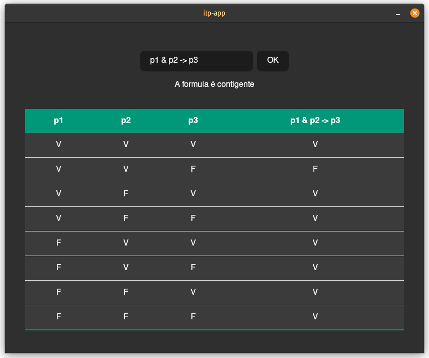

## Descrição

O interpretador recebe uma expressão gera uma tabela verdade e exibe o tipo de expressão(contigente, tautologia ou contradição).

Na pasta `ilp` temos a biblioteca da linguagem proposicional, contendo os componentes da linguagem.

`ilp-app`  é uma aplicação criada com `tauri` que utiliza a biblioteca `ilp`.
## dev

### requisitos

- NodeJS - LTS/iron
- Rust

https://v2.tauri.app/start/prerequisites


na pasta `ilp-app` rodar o comando `npm install` e `npm run tauri dev`.

```bash
cd ilp-app
npm install
npm run tauri dev
```

##

